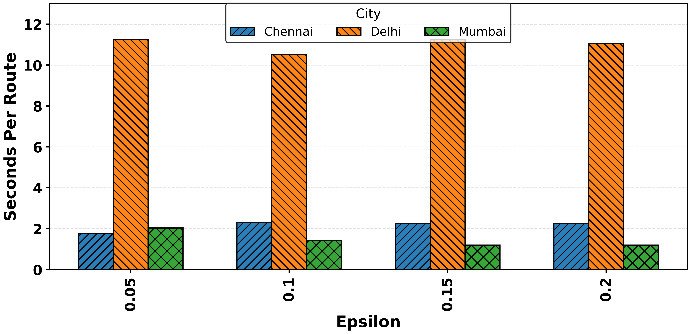

# GATE-DT Dataset

<p align="center">
  
  
  
  
</p>

---

# Dataset Overview

This directory contains the processed datasets used for the GATE-DT eco-routing and congestion-aware transportation framework. The datasets include:

* City-scale traffic observations
* Road-network grid statistics
* Time-series mobility data
* Air-quality indicators
* NOx and PM$_{2.5}$ aligned measurements
* Multi-city experimental routing records

---

# Dataset Structure

| Dataset File                    | Description                                      | City    | Type         |
| ------------------------------- | ------------------------------------------------ | ------- | ------------ |
| `Delhi-timeseriesdataset.csv`   | Daily traffic and environmental time-series data | Delhi   | Time-Series  |
| `Delhigriddedmapdata.csv`       | Grid-based spatial traffic representation        | Delhi   | Spatial Grid |
| `Mumbai-timeseriesdataset.csv`  | Daily traffic and environmental time-series data | Mumbai  | Time-Series  |
| `Mumbaigriddedmapdata.csv`      | Grid-based spatial traffic representation        | Mumbai  | Spatial Grid |
| `Chennai-timeseriesdataset.csv` | Daily traffic and environmental time-series data | Chennai | Time-Series  |
| `Chennai-griddedmapdata.csv`    | Grid-based spatial traffic representation        | Chennai | Spatial Grid |

---

# Complete CSV Dataset Files

## 1. `Delhi-timeseriesdataset.csv`

<table>
<tr>
<th style="background-color:#0D47A1;color:white;">Column</th>
<th style="background-color:#0D47A1;color:white;">Description</th>
</tr>
<tr><td>Date</td><td>Daily observation timestamp</td></tr>
<tr><td>Traffic Density</td><td>Normalized congestion intensity</td></tr>
<tr><td>Average Speed</td><td>Average network vehicle speed</td></tr>
<tr><td>NOx</td><td>Nitrogen oxide concentration</td></tr>
<tr><td>PM2.5</td><td>Fine particulate matter concentration</td></tr>
</table>

### Sample Records

| Date       | Traffic Density | Average Speed | NOx  | PM2.5 |
| ---------- | --------------- | ------------- | ---- | ----- |
| 2021-01-01 | 0.82            | 34.1          | 58.3 | 112.7 |
| 2021-01-02 | 0.79            | 35.6          | 55.8 | 108.2 |
| 2021-01-03 | 0.88            | 31.5          | 61.4 | 119.9 |

---

## 2. `Delhigriddedmapdata.csv`

<table>
<tr>
<th style="background-color:#1565C0;color:white;">Column</th>
<th style="background-color:#1565C0;color:white;">Description</th>
</tr>
<tr><td>Grid ID</td><td>Unique spatial grid identifier</td></tr>
<tr><td>Latitude</td><td>Grid center latitude</td></tr>
<tr><td>Longitude</td><td>Grid center longitude</td></tr>
<tr><td>Congestion Score</td><td>Grid-level congestion intensity</td></tr>
<tr><td>Emission Level</td><td>Estimated environmental pollution level</td></tr>
</table>

### Sample Records

| Grid ID | Latitude | Longitude | Congestion Score | Emission Level |
| ------- | -------- | --------- | ---------------- | -------------- |
| DL_001  | 28.6139  | 77.2090   | 0.87             | High           |
| DL_002  | 28.6450  | 77.1870   | 0.73             | Medium         |

---

## 3. `Mumbai-timeseriesdataset.csv`

<table>
<tr>
<th style="background-color:#1B5E20;color:white;">Column</th>
<th style="background-color:#1B5E20;color:white;">Description</th>
</tr>
<tr><td>Date</td><td>Daily observation timestamp</td></tr>
<tr><td>Traffic Density</td><td>Normalized congestion intensity</td></tr>
<tr><td>Average Speed</td><td>Average network vehicle speed</td></tr>
<tr><td>NOx</td><td>Nitrogen oxide concentration</td></tr>
<tr><td>PM2.5</td><td>Fine particulate matter concentration</td></tr>
</table>

### Sample Records

| Date       | Traffic Density | Average Speed | NOx  | PM2.5 |
| ---------- | --------------- | ------------- | ---- | ----- |
| 2021-01-01 | 0.91            | 28.4          | 66.1 | 131.4 |
| 2021-01-02 | 0.87            | 30.2          | 63.7 | 126.8 |
| 2021-01-03 | 0.93            | 27.5          | 68.5 | 135.9 |

---

## 4. `Mumbaigriddedmapdata.csv`

<table>
<tr>
<th style="background-color:#2E7D32;color:white;">Column</th>
<th style="background-color:#2E7D32;color:white;">Description</th>
</tr>
<tr><td>Grid ID</td><td>Unique spatial grid identifier</td></tr>
<tr><td>Latitude</td><td>Grid center latitude</td></tr>
<tr><td>Longitude</td><td>Grid center longitude</td></tr>
<tr><td>Congestion Score</td><td>Grid-level congestion intensity</td></tr>
<tr><td>Emission Level</td><td>Estimated environmental pollution level</td></tr>
</table>

### Sample Records

| Grid ID | Latitude | Longitude | Congestion Score | Emission Level |
| ------- | -------- | --------- | ---------------- | -------------- |
| MB_001  | 19.0760  | 72.8777   | 0.92             | High           |
| MB_002  | 19.1120  | 72.8560   | 0.81             | Medium         |

---

## 5. `Chennai-timeseriesdataset.csv`

<table>
<tr>
<th style="background-color:#6A1B9A;color:white;">Column</th>
<th style="background-color:#6A1B9A;color:white;">Description</th>
</tr>
<tr><td>Date</td><td>Daily observation timestamp</td></tr>
<tr><td>Traffic Density</td><td>Normalized congestion intensity</td></tr>
<tr><td>Average Speed</td><td>Average network vehicle speed</td></tr>
<tr><td>NOx</td><td>Nitrogen oxide concentration</td></tr>
<tr><td>PM2.5</td><td>Fine particulate matter concentration</td></tr>
</table>

### Sample Records

| Date       | Traffic Density | Average Speed | NOx  | PM2.5 |
| ---------- | --------------- | ------------- | ---- | ----- |
| 2021-01-01 | 0.71            | 41.8          | 44.3 | 82.7  |
| 2021-01-02 | 0.69            | 42.9          | 42.6 | 79.5  |
| 2021-01-03 | 0.75            | 39.7          | 46.2 | 85.8  |

---

## 6. `Chennai-griddedmapdata.csv`

<table>
<tr>
<th style="background-color:#8E24AA;color:white;">Column</th>
<th style="background-color:#8E24AA;color:white;">Description</th>
</tr>
<tr><td>Grid ID</td><td>Unique spatial grid identifier</td></tr>
<tr><td>Latitude</td><td>Grid center latitude</td></tr>
<tr><td>Longitude</td><td>Grid center longitude</td></tr>
<tr><td>Congestion Score</td><td>Grid-level congestion intensity</td></tr>
<tr><td>Emission Level</td><td>Estimated environmental pollution level</td></tr>
</table>

### Sample Records

| Grid ID | Latitude | Longitude | Congestion Score | Emission Level |
| ------- | -------- | --------- | ---------------- | -------------- |
| CH_001  | 13.0827  | 80.2707   | 0.68             | Medium         |
| CH_002  | 13.0418  | 80.2341   | 0.59             | Low            |

---

# Spatial Grid Dataset Preview

## Delhi Grid Dataset

<table>
<tr>
<th style="background-color:#37474F;color:white;">Grid ID</th>
<th style="background-color:#37474F;color:white;">Latitude</th>
<th style="background-color:#37474F;color:white;">Longitude</th>
<th style="background-color:#37474F;color:white;">Congestion Score</th>
<th style="background-color:#37474F;color:white;">Emission Level</th>
</tr>
<tr>
<td>DL_001</td>
<td>28.6139</td>
<td>77.2090</td>
<td>0.87</td>
<td>High</td>
</tr>
<tr>
<td>DL_002</td>
<td>28.6450</td>
<td>77.1870</td>
<td>0.73</td>
<td>Medium</td>
</tr>
</table>

---

# Experimental Configuration

| Parameter              | Value                   |
| ---------------------- | ----------------------- |
| Number of Cities       | 3                       |
| Daily Samples per City | 365                     |
| OD Pairs per City      | 100                     |
| Candidate Routes       | 25                      |
| Random Seed            | 42                      |
| Traffic Features       | Congestion, Speed, Flow |
| Environmental Features | NOx, PM$_{2.5}$         |

---

# Loading the Dataset

## Python Example

```python
import pandas as pd

# Load Delhi dataset
file_path = "Dataset/Delhi-timeseriesdataset.csv"

df = pd.read_csv(file_path)

print(df.head())
```

---

# Dataset Visualization

<p align="center">
  
</p>

---

# Citation

```bibtex
@article{gate_dt_2026,
  title={Carbon-Aware Agentic Digital Twin Framework for Eco-Routing},
  author={Suleman et al.},
  journal={Under Review},
  year={2026}
}
```

---

# License

This dataset is provided for academic and research purposes only.
