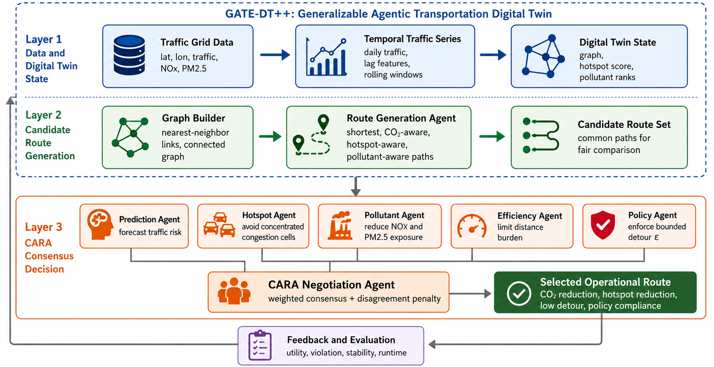
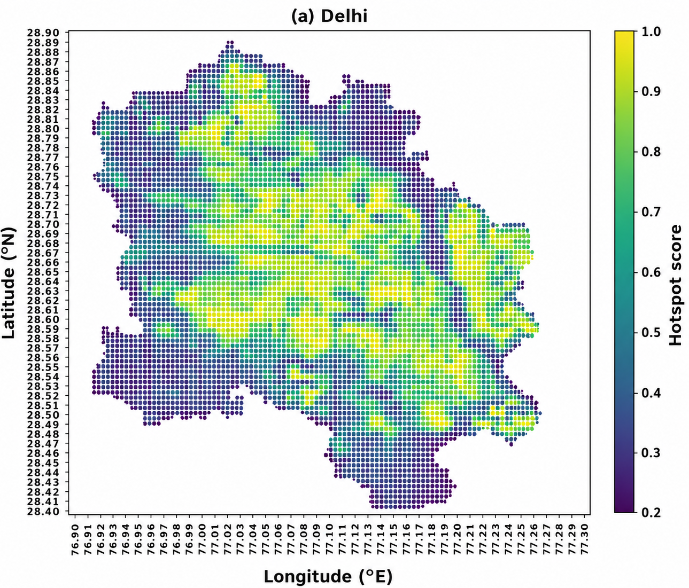
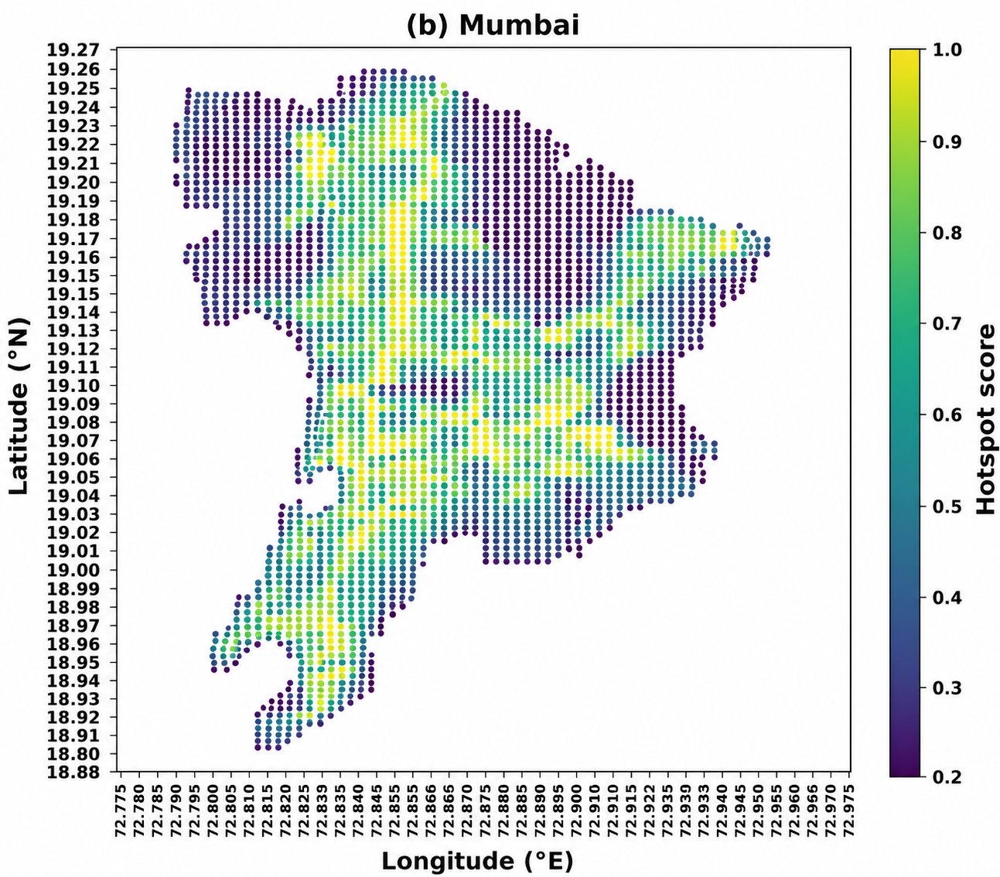
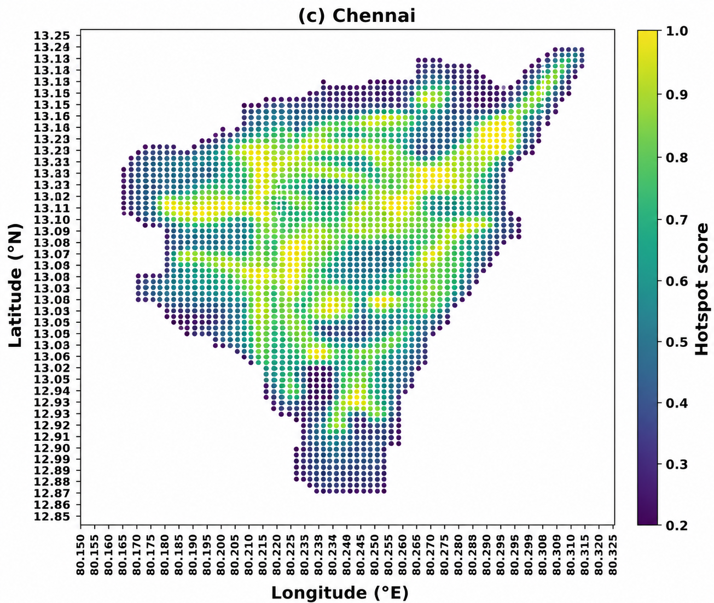
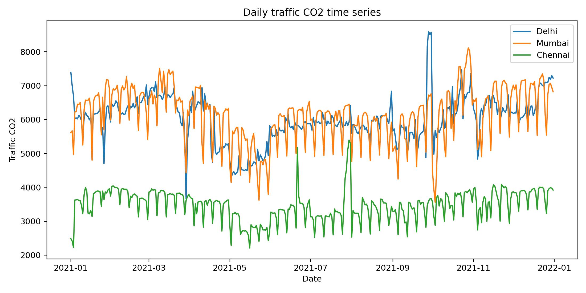

# GATE-DT++: Consensus Agentic Digital Twin for Operational Eco-Routing

<p align="center">
  
</p>

<p align="center">
  <b>Operationally-constrained carbon-aware urban routing using transportation digital twins and multi-agent consensus negotiation.</b>
</p>

<p align="center">


</p>

---

# Overview

GATE-DT++ is a transportation digital twin framework for operational eco-routing in urban transportation systems.

The framework combines:

- Traffic prediction
- Hotspot-aware routing
- Pollutant exposure estimation
- Policy-constrained routing
- Consensus-based multi-agent negotiation

---

# Proposed Architecture

<p align="center">
  
</p>

---

# CARA Routing Workflow

<p align="center">
  
</p>

---

# Dataset Description

| City | Grid Cells | Active Cells | Traffic Sum | Top-10% Share | Routing Setup |
|---|---:|---:|---:|---:|---:|
| Delhi | 8072 | 7518 | 620121.868 | 30.89 | 100 OD pairs |
| Mumbai | 2260 | 1868 | 590531.445 | 29.74 | 100 OD pairs |
| Chennai | 1997 | 1904 | 321383.511 | 21.46 | 100 OD pairs |

---

# Hotspot Distributions

<p align="center">





</p>

---

# Prediction Performance

| Model | Chennai RMSE | Delhi RMSE | Mumbai RMSE |
|---|---:|---:|---:|
| Linear Regression | 0.212 | 0.169 | 0.158 |
| Ridge Regression | 0.181 | 0.158 | 0.151 |
| Random Forest | 0.136 | 0.131 | 0.139 |
| Gradient Boosting | 0.134 | 0.129 | 0.137 |
| ExtraTrees | **0.132** | **0.126** | **0.135** |

---

# Cross-City Routing Performance

| Method | CO2 Reduction (%) | Policy Violation (%) | Distance Penalty (%) | Operational Utility |
|---|---:|---:|---:|---:|
| Weighted Eco-Routing | 46–58 | 4–7 | 12–15 | Negative |
| Prediction-Aware Routing | 48–61 | 7–9 | 15–18 | Negative |
| Single-Agent Routing | 52–64 | 16–22 | 26–32 | Very Negative |
| CO2 Dijkstra | 55–69 | 28–48 | 39–59 | Worst |
| CARA Consensus Routing | 21–30 | 0.0 | 3–4 | Best |

---

# Decision-Time Analysis

<p align="center">
  
</p>

---

# Traffic Forecasting

<p align="center">
  
</p>

---

# Repository Structure

```text
GATE-DT/
│
├── Code/
├── Dataset/
├── Figures/
├── Results/
├── README.md
```

---

# Installation

```bash
git clone https://github.com/mishaurooj/GATE-DT.git
cd GATE-DT
pip install -r requirements.txt
```

---

# Citation

```bibtex
@article{gate_dt_2026,
  title={GATE-DT++: A Consensus Agentic Digital Twin Framework for Operationally-Constrained Eco-Routing in Urban Transportation Networks},
  author={Khan, Ajmal and Khan, Misha Urooj and Suleman, Ahmad and Kaleem, Zeeshan},
  journal={IEEE},
  year={2026}
}
```

---

# Contact

Ahmad Suleman  
National Center for Physics, Islamabad, Pakistan

Email: engineersuleman118@gmail.com
